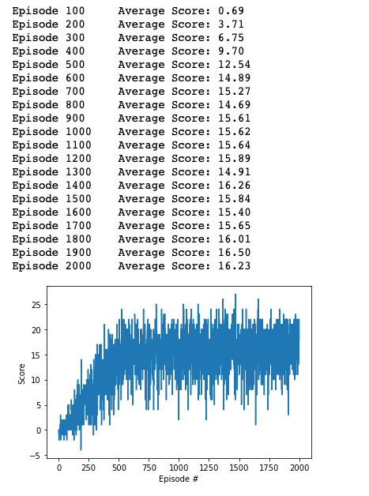
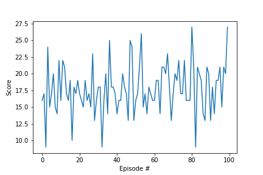

[image1]: https://user-images.githubusercontent.com/10624937/42135619-d90f2f28-7d12-11e8-8823-82b970a54d7e.gif "Trained Agent"

# Project 1: Navigation

### Introduction from Udacity

For this project, you will train an agent to navigate (and collect bananas!) in a large, square world.  

![Trained Agent][image1]

A reward of +1 is provided for collecting a yellow banana, and a reward of -1 is provided for collecting a blue banana.  Thus, the goal of your agent is to collect as many yellow bananas as possible while avoiding blue bananas.  

The state space has 37 dimensions and contains the agent's velocity, along with ray-based perception of objects around agent's forward direction.  Given this information, the agent has to learn how to best select actions.  Four discrete actions are available, corresponding to:
- **`0`** - move forward.
- **`1`** - move backward.
- **`2`** - turn left.
- **`3`** - turn right.

The task is episodic, and in order to solve the environment, your agent must get an average score of +13 over 100 consecutive episodes.

### Implementation

Deep Q-Network (DQN) looks like a good approach to solve this problem. DQN was introduced by DeepMind. It uses a Deep Neural Network to implement an approximation to the optimal state-value function in an reinforcement learning context.

However, reinforcement learning is notoriously unstable when DNNs are used to represent the action values. Two key features to overcome this issue are experience replay and fixed Q-targets. Both have been implemented in the DQN programming exercise of this nano degree. The solution presented here is building on this code.

In a first attempt the following architecture and hyper-parameters were used to implement DQN:

```
QNetwork(
  (fc1): Linear(in_features=37, out_features=128, bias=True)
  (fc2): Linear(in_features=128, out_features=64, bias=True)
  (fc3): Linear(in_features=64, out_features=4, bias=True)
)
```

- EPISODES = 2000
- BUFFER_SIZE = int(1e5)  # replay buffer size
- BATCH_SIZE = 64         # minibatch size
- GAMMA = 0.99            # discount factor
- TAU = 1e-3              # for soft update of target parameters
- LR = 5e-4               # learning rate 
- UPDATE_EVERY = 4        # how often to update the network

An agent trained this way for 2000 episodes achieved an average score of ... . What stood out was that the agent often got stuck, repeating the same actions, without making any progress. To monitor this behavior a set of fifos was added to the agent to track the actions. When the agent was stuck is issued actions like this:


**Stuck action patterns encountered**

Monitored for sequences of 10 actions.

```
[1010101010]
[0101010101]
[2323232323]
[3232323232]
[0011001100]
[0110011001]
```

This first implementation also tends to get stuck at the walls. One way to fix this would be in the environment to give a negative reward for hitting a wall. But we cannot change the incentives since they are hard-coded in the Unity environment. Instead a slightly deeper network was evaluated to see if it can help fix this.

Second network architecture evaluated:

```
QNetwork(
  (fc1): Linear(in_features=37, out_features=128, bias=True)
  (fc2): Linear(in_features=128, out_features=64, bias=True)
  (fc3): Linear(in_features=64, out_features=16, bias=True)
  (fc4): Linear(in_features=16, out_features=4, bias=True)
)
```

This network did work much better. It did not get stuck at walls anymore. However, there were still situations where the agent was stuck, exhibiting same patterns of action as recorded above. To fix this a filter was added to the agent that detects these patterns from the fifos and issues random actions if such patterns are encountered.

This turned to work out very well in situations when the agent was stuck. Instead of seeing low scores of down to 2, they were ot lower than about 9. Since these situations don't occur too often they did not improve the average score of evaluting the agent for 100 episodes significantly, but still noticably.

Snapshot of training scores:




Best average over 100 episode evaluation with filter was achieved at 17.75. Here is a picture of the scores during evaluation:


